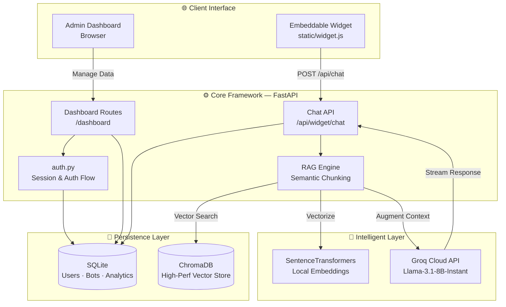

# 🤖 RAG-Based-Chatbot — SaaS Platform

[](https://github.com/PythonicDG/RAG-Based-Chatbot)
[](https://fastapi.tiangolo.com)
[](https://www.python.org)
[](https://www.trychroma.com)
[](https://groq.com)
[](https://opensource.org/licenses/MIT)

> A production-ready, multi-tenant chatbot platform powered by **Retrieval-Augmented Generation (RAG)**. Securely upload documents, create specialized AI bots, and embed them anywhere with a single line of code.

*Last Updated: April 2026*

---

## ✨ Features

| Category | Description |
|---|---|
| 🧠 **Multi-Tenant RAG** | Create multiple bots; each maintains its own isolated document collection and vector store. |
| 📄 **Advanced Ingestion** | Efficient PDF extraction and semantic chunking with local embedding models (MiniLM-L6-v2). |
| 🔐 **Enterprise Auth** | Secure signup/login system with session-based persistence and password hashing. |
| 📊 **Actionable Analytics** | Real-time tracking of message counts, unique sessions, and average response latency. |
| 🌐 **Seamless Embedding** | Lightweight, high-performance JS widget with Markdown support and history persistence. |
| 🛠️ **Admin Dashboard** | Full-featured control panel to manage bots, upload docs, and view performance metrics. |
| 🏥 **Health Monitoring** | Detailed system health and statistics endpoints (`/health/detailed`). |

---

## 🛠️ Tech Stack

- **Backend**: FastAPI (Python 3.10+)
- **Database**: SQLite (SQLAlchemy ORM)
- **Vector Store**: ChromaDB
- **LLM API**: Groq (Llama 3.1)
- **Embeddings**: Sentence-Transformers (Local)
- **Frontend**: Vanilla Javascript (Widget), Jinja2 (Dashboard)

---
|---|---|
| 🧠 **Multi-Tenant RAG** | Create multiple bots; each maintains its own isolated document collection and vector store. |
| 📄 **Advanced Ingestion** | Efficient PDF extraction and semantic chunking with local embedding models (MiniLM-L6-v2). |
| 🔐 **Enterprise Auth** | Secure signup/login system with session-based persistence and password hashing. |
| 📊 **Actionable Analytics** | Real-time tracking of message counts, unique sessions, and average response latency. |
| 🌐 **Seamless Embedding** | Lightweight, high-performance JS widget with Markdown support and history persistence. |
| 🛠️ **Admin Dashboard** | Full-featured control panel to manage bots, upload docs, and view performance metrics. |
| 🏥 **Health Monitoring** | Detailed system health and statistics endpoints (`/health/detailed`). |

---

## 🏗️ Architecture

The platform is designed for scalability and performance, combining high-speed retrieval with low-latency LLM inference.



---

## 🚀 Quick Start

### 1 — Clone & Prepare Environment

```bash
git clone <repo-url>
cd RAG-Based-Chatbot
python -m venv venv
# On Windows:
venv\Scripts\activate
# On Unix or MacOS:
source venv/bin/activate
```

### 2 — Install Components

```bash
pip install -r requirements.txt
```

### 3 — System Configuration

Create your `.env` file from the example:

```bash
cp .env.example .env
```

| Variable | Description |
|---|---|
| `GROQ_API_KEY` | Your API key from [console.groq.com](https://console.groq.com). |
| `SECRET_KEY` | A random string for session signing (security critical). |
| `LLM_MODEL` | Default LLM (e.g., `llama-3.1-8b-instant`). |
| `CHUNK_SIZE` | Size of document chunks for vectorization (default: 500). |
| `CHUNK_OVERLAP` | Overlap between chunks (default: 50). |

### 4 — Launch Platform

```bash
# Production (via Uvicorn)
uvicorn app:app --host 0.0.0.0 --port 5001

# Development (with auto-reload)
python app.py
```

### 5 — Onboard Admin

Visit [http://127.0.0.1:5001/auth/signup](http://127.0.0.1:5001/auth/signup) to create your first administrative user.

---

## 🔌 Embedding a Bot

Add your bot to any website by pasting this script before the closing `</body>` tag:

```html
<script src="http://localhost:5001/static/widget.js" data-bot-id="YOUR_BOT_ID"></script>
```

Replace `YOUR_BOT_ID` with the ID from your bot's dashboard. Replace `localhost:5001` with your production URL when deployed.

---

## 📋 API Overview

| Endpoint | Method | Purpose |
|---|---|---|
| `/api/widget/chat` | `POST` | The RAG engine endpoint for bots. |
| `/health` | `GET` | Basic liveness check. |
| `/health/detailed` | `GET` | System stats including bot/doc counts and model status. |
| `/auth/*` | `GET/POST` | Authentication routes. |
| `/dashboard/*` | `GET/POST` | Bot and document management. |

---

## 📁 Project Overview

- **`app.py`**: The heart of the platform — FastAPI application and core logic.
- **`auth.py`**: Secure authentication handles (Login, Signup, Logout).
- **`models.py`**: Database schemas for multi-tenancy.
- **`static/widget.js`**: The frontend chat component optimized for performance.
- **`chroma_db/`**: Persistent vector indices for fast document retrieval.
- **`uploads/`**: Temporarily stores PDF documents for ingestion.

---

## ☁️ Deployment

The application is containerized and compatible with modern cloud platforms:

- **Docker**: Build and run locally or on any cloud VPS.
- **Railway/Render**: Native support for FastAPI/Uvicorn.
- **Vercel**: Can be deployed with appropriate adaptations for serverless functions.

---

## 📜 License

Distributed under the **MIT License**. See `LICENSE` for more information.

---

Built with ❤️ by the RAG Chatbot Team.
