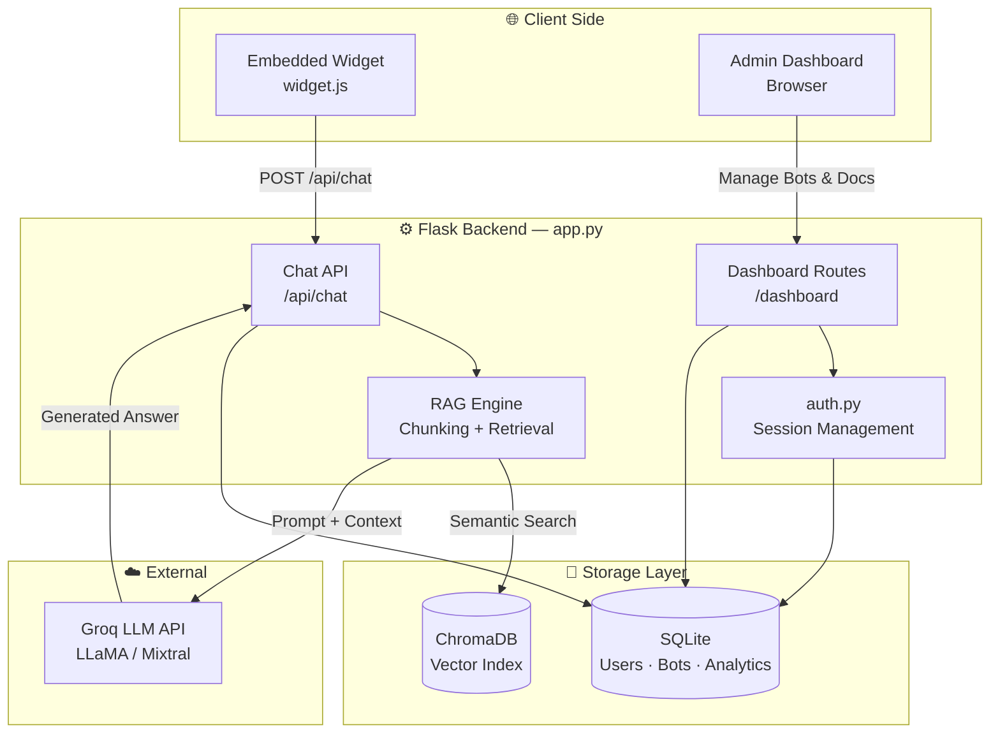

# 🤖 RAG Chatbot — SaaS Platform

> A production-ready, multi-tenant chatbot platform powered by **Retrieval-Augmented Generation (RAG)**. Upload documents, configure bots, and embed them anywhere in one line of code.

---

## ✨ Features

| Feature | Description |
|---|---|
| 🧠 **Bot-Centric RAG** | Each bot answers *only* from its assigned document collection |
| 📄 **Smart Ingestion** | Auto-chunking of PDFs with semantic search via ChromaDB |
| 🔐 **Secure Auth** | Signup/login with persistent sessions |
| 📊 **Analytics** | Track messages, unique sessions, and response latency |
| 🌐 **Embeddable Widget** | One `<script>` tag — Markdown support, session persistence |
| 🗂️ **Admin Dashboard** | Manage bots, upload documents, view stats |

---

## 🏗️ Architecture



---

## 🚀 Quick Start

### 1 — Clone & create a virtual environment

```bash
git clone <repo-url>
cd <repo>
python -m venv venv
venv\Scripts\activate        # Windows
# source venv/bin/activate   # macOS / Linux
```

### 2 — Install dependencies

```bash
pip install -r requirements.txt
```

### 3 — Configure environment

```bash
cp .env.example .env
```

Edit `.env` with your credentials:

```env
GROQ_API_KEY=your_groq_api_key
SECRET_KEY=your_session_secret
```

### 4 — Run

```bash
python app.py
```

### 5 — Create your admin account

Visit → **http://127.0.0.1:5001/auth/signup**

---

## 📁 Project Structure

```
.
├── app.py              # Backend API & dashboard routes
├── auth.py             # Authentication logic
├── models.py           # SQLAlchemy database models
├── static/
│   └── widget.js       # Embeddable chat widget
├── templates/
│   ├── auth/           # Login / Signup pages
│   └── dashboard/      # Admin panel & analytics
├── instance/           # SQLite database files
└── chroma_db/          # ChromaDB vector store index
```

---

## 🔌 Embedding a Bot

Paste a single line into any website:

```html
<script src="https://your-domain/static/widget.js" data-bot-id="YOUR_BOT_ID"></script>
```

The widget supports **Markdown rendering**, **message history**, and **session management** out of the box.

---

## 🛠️ Tech Stack

- **Backend** — Python, Flask, SQLAlchemy
- **Vector DB** — ChromaDB
- **LLM** — Groq (LLaMA / Mixtral)
- **Auth** — Flask-Login + bcrypt
- **Frontend** — Vanilla JS widget, Jinja2 templates